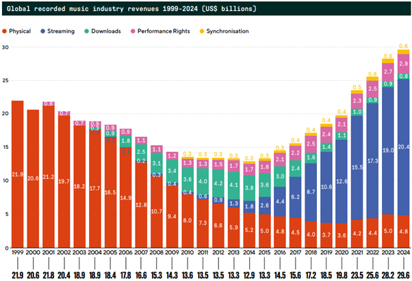

# Trabajo final Computación I, grupo 10

-   Dataset: 18. Spotify 2015-2025
-   Integrantes: Jorge Torres, Arianna Oliveros

# Introducción.

---

## Estructura del informe.

---

# Planteamiento del problema.

En la última década, hay una inclinación a los videos de formato corto y vertical. Debido al auge que tuvo la aplicación Tiktok. En 2020, TikTok superó los 2 mil millones de visualizaciones en todo el mundo (Influencer Marketing Hub, 2020, como se citó en Navarro-Güere, 2024). Y, además, esta red social motiva a sus usuarios a generar contenido corto y vertical, para optimizar los vídeos en TikTok, la red social recomienda que los vídeos se graben siempre en modo vertical (Simplified, 2022, como se citó en Navarro-Güere, 2024)

Debido al éxito general que venía amasando la red social TikTok, otras plataformas empezaron a adaptarse a este tipo de formato vertical y corto, La sección Instagram Reels apareció en 2020 —diez años después que la aplicación Instagram— donde se graban y editan vídeos de clips de 15, 30 o 60 segundos con audio, efectos, stickers, audio y otros recursos (Instagram, 2020; Alexander, 2020; Lenis, 2023, como se citó en Navarro-Güere, 2024). Así mismo, la red social Youtube, se adaptó con la implementación de Youtube shorts, según YouTube (s.f.) Shorts es la plataforma para grabar, compartir y maratonear videos cortos (de 60 segundos o menos) en YouTube.

A la par de esto, según el reciente informe de la IFPI (2024) las ventas de la industria musical han venido migrando de un formato físico a un formato de streaming, pasando de discos en formato físico al uso de plataformas de audio streaming o de video streaming.

Como podemos apreciar en el gráfico, las ventas musicales a nivel global en la modalidad de streaming para el año 2024 estaban conformadas por un total de 20.4 billones de USD representando al 69% de las ventas producidas por la industria musical, y ha mantenido un incremento desde 2011.

Así mismo, el auge de los videos de formato vertical ha reconfigurado la manera en que las audiencias más jóvenes consumen contenido sonoro. De acuerdo con los datos recopilados en el estudio Engaging with Music (IFPI, 2023), el 82% de los usuarios con edades comprendidas entre los 16 y 24 años interactúa con la música diariamente a través de plataformas de videos cortos. Esta preferencia sitúa a este formato por encima de alternativas tradicionales y digitales, dejando en segundo plano al streaming de audio puro (72%) y a las plataformas de video convencionales (66%).

Del mismo modo, según Ngilangil (2022) en un estudio realizado en los estudiantes de la universidad Surigao del Norte State University (SNSU), en el que se analizó qué elementos garantizan el éxito de un video de TikTok, se observa que el contenido, la calidad visual y la música son factores muy influyentes para los usuarios.

Tomando en consideración que el mercado de la industria musical está siendo mayoritariamente dominado por plataformas de streaming, y que a su vez gran parte de su consumo proviene de formatos verticales y breves, surge la siguiente interrogante: ¿Es posible que este fenómeno esté condicionando la producción de nuevas piezas musicales, impulsando una reducción en su duración para adaptarse a estos vídeos y plataformas para así aumentar sus probabilidades de éxito?

En base a lo anterior se plantean las siguientes preguntas de investigación:

-   ¿Cómo ha evolucionado el promedio de duración de las canciones a nivel global entre 2015 y 2025?

-   ¿Cuál es el comportamiento en las variables de tempo y energy durante 2015-2025?

-   ¿De qué forma se comporta la duración de las canciones según el país entre el periodo 2015-2025?

-   ¿Cuál es la correlación estadística entre los atributos acústicos de las canciones como duración, tempo y energy y su nivel de popularidad en el periodo 2015-2025?

## Justificacion.

Esta investigación es fundamental para comprender la transformación estructural del producto musical ante la presión de los algoritmos de recomendación. Desde una perspectiva de mercado, confirmar una tendencia decreciente en la duración y creciente en la velocidad permitiría a productores y sellos discográficos alinear sus estrategias de creación con los patrones de consumo actuales. Desde una perspectiva estadística, el estudio se justifica al integrar un análisis de correlación que desafía la intuición común: demostrar si el éxito es multifactorial o si depende linealmente de atributos específicos. Además, al contrastar estos datos por país, el estudio aportará valor al identificar si la globalización digital está homogeneizando los rasgos culturales de la música o si persisten resistencias locales ante la tendencia a contenido breve.

## Objectivos

### Objectivo General.

Analizar la evolución de la duración estructural y características acústicas de las canciones producidas por la industria musical global durante la última década, en el contexto del auge de los formatos de video corto.

### Objetivos Específicos.

-   Determinar la tendencia de la duración: Describir la evolución del promedio de duración por año y analizar su tendencia.

-   Evaluar la aceleración rítmica: Analizar el comportamiento anual de las variables tempo y energy para identificar patrones o tendencias.

-   Contrastar la consistencia geográfica: Comparar los promedios de duración y velocidad entre los 10 países del dataset para establecer si el fenómeno de inmediatez es globalmente homogéneo o presenta variaciones regionales significativas.

-   Validar la independencia de variables: Evaluar la relación lineal entre los atributos acústicos individuales de las canciones y su índice de popularidad, para determinar si el éxito comercial depende de factores aislados o es multifactorial.

###### Dashboard con Streamlit: <https://trabajo-final-8uor.onrender.com/>

###### Informe Estadístico con R Markdown: ...

##  
